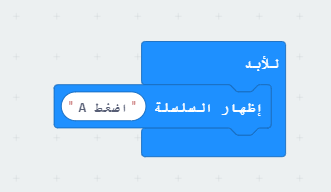

## تمرير النص

لنبدأ بتمرير بعض الإرشادات النصية على micro: bit.

+ اذهب إلى <a href="https://rpf.io/microbit-new" target="_blank">rpf.io/microbit-new</a> لبدء مشروع جديد في محرر MakeCode (PXT). سمي مشروعك الجديد "قارئ المستقبل".

يمكنك حذف ` إلى الأبد ` عن طريق سحبها فوق اللوحة ، فأنت لا تحتاج اليها لهذا المشروع.

+ اسحب التعليمة` إظهار النص` داخل كتلة `start` الخاصة بك.

+ اختبر مشروعك. يمكنك اختباره في المحاكي أو على المايكروبيت (micro:bit) نفسه.