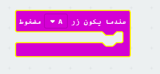
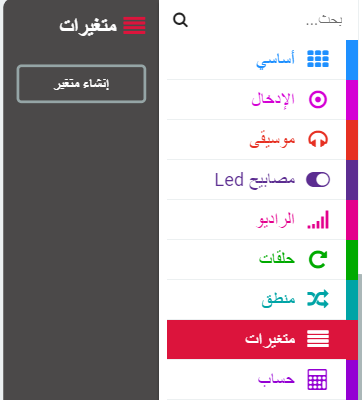
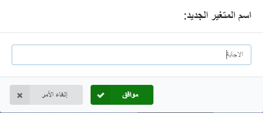
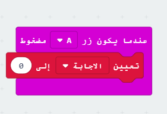
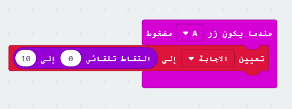
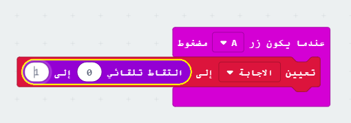
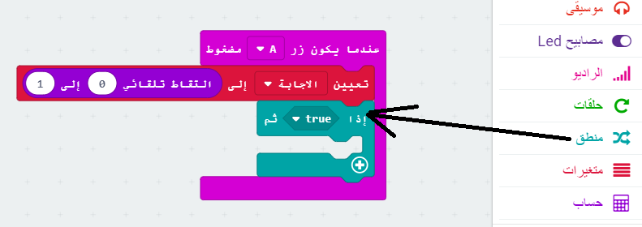
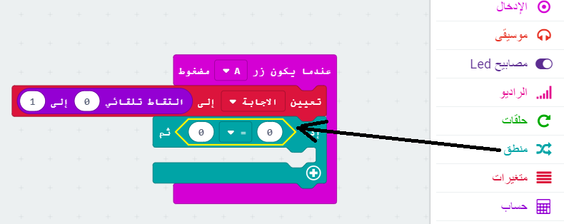
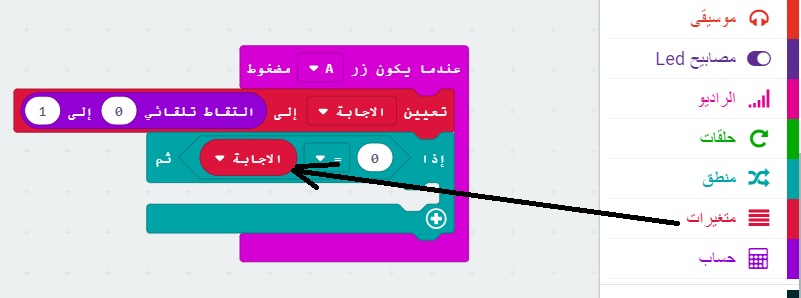
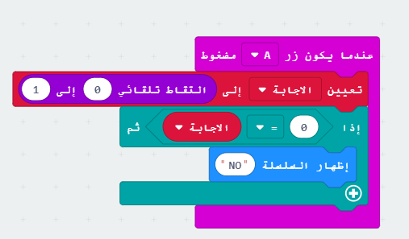

## اتخاذ القرار

دعنا نحصل على المايكروبيت (micro:bit) لاتخاذقرار عن طريق الاختيار العشوائي لعدد (`0` ل 'لا' و `1` ل 'نعم').

+ إضافة حدث جديد `على الزر A مضغوط` إلى التعليمة الخاص بك.

+ لنقم بإنشاء متغير جديد لتخزين الإجابة. انقر فوق 'المتغيرات' ثم انقر فوق 'انشاء متغير'.

+ قم بتسمية المتغير الجديد `جواب`.

+ اسحب التعليمة`تعيين` من المتغيرات إلى التعليمة`الضغط على زر A `وحدد متغير `جواب`.

كما ترى `إلى` في المربع البرمجي أنه يمكنك تعيين الإجابة لعرضها.

+ انقر فوق "حساب" واسحب التعليمة`اختر عشوائيًا` بعد `إلى`:

+ أخبر التعليمة العشوائية لاختيار رقم بين 0 و 1. إليك كيفية ظهور شفرتك:

+ بعد ذلك، تريد عرض كلمة `كلا` على المايكروبيت (micro:bit) فقط `إذا كان` `جواب` هو 0.

للقيام بذلك، اسحب التعليمة`if` في الجزء السفلي من الحدث `على الزر A مضغوط`:

+ ثم قم بسحب التعليمة`=` كشرط في `if`:

+ اسحب المتغير `جواب` على الجانب الأيسر من التعليمة`if`.

+ أي تعليمة داخل التعليمة البرمجية`if` سيتم تشغيله فقط إذا كان `الإجابة` 0. بما أن 0 هو `No`، دعنا نضيف تعليمة `إظهار النص`.

+ اختبر مشروعك. 
    + في بعض الأحيان ستكون`الإجابة` 0، وينبغي للمايكروبيت (micro:bit) أن يقول "No".
    + في بعض الأحيان سيكون `الإجابة` 1، ولن يحدث شيء!