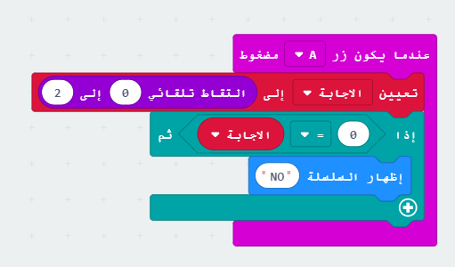

\--- challenge \---

## التحدي: إجابات متعددة

هل يمكنك إضافة تعليمة برمجية بحيث يتم عرض 'Yes' على المايكروبيت (micro:bit) **إذا** الإجابة هي 1؟ يمكنك حتى تغيير النص المعروض إلى شيء أكثر إثارة من 'Yes' و 'No'!

يمكنك حتى جعل المايكروبيت (micro:bit) يقول شيئا مثل 'Maybe' Ask again' إذا كان الجواب 2. للحصول على هذا العمل ، ستحتاج أيضًا إلى تغيير التعليمة لاختيار رقم عشوائي بين 0 و 2!

نصيحة: يمكنك النقر بزر الماوس الأيمن على التعليمة`if` لتكرار التعليمة ومحتوياتها.

\--- /challenge \---