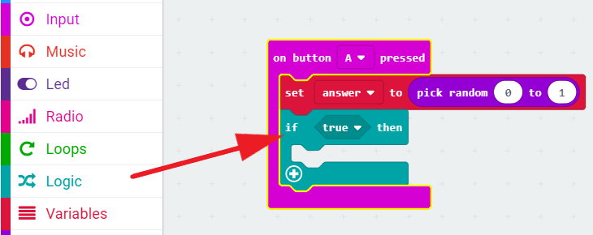
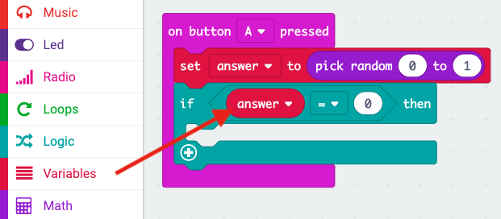

## Gwneud penderfyniad

Gadewch i ni gael eich micro:bit i wneud penderfyniad wrth ddewis rhif ar hap (`0` ar gyfer 'Na' a `1` ar gyfer 'Ie'.

+ Ychwanegwch ddigwyddiad `on button A pressed` (botwm A wedi'i wasgu) newydd i'ch cod.

+ Gadewch i ni greu newidyn newydd i storio'r ateb. Cliciwch y 'Variables' (Newidynnau) ac yna cliciwch 'Make a variable' (Gwneud newidyn).

+ Enwch y newidyn newydd yn `ateb`.

+ Llusgwch floc `set` o Newidynnau i mewn i'ch bloc `on button A pressed` a dewiswch y newidyn `ateb`.

Fel y gallwch weld, mae'r `to` (i) yn y bloc yn golygu y gallwch osod yr ateb i arddangos.

+ Cliciwch 'Math' a llusgo bloc `pick random` (dewis ar hap) ar ôl y `to` (i):

+ Dywedwch wrth y bloc ar hap am ddewis rhif rhwng 0 a 1. Dyma sut y dylai eich cod ymddangos:

+ Nesaf, rydych chi am arddangos y gair `Na` ar y micro:bit yn unig `if` (os) yw'r `ateb` yn 0.

I wneud hyn, llusgwch floc `if` ar waelod eich digwyddiad `on button A pressed`:

+ Nesaf llusgwch floc `=` fel yr amod yn y `if`:

+ Llusgwch eich newidyn `ateb` ar ochr chwith y bloc `if`.

+ Ni fydd unrhyw god tu mewn i'r bloc `if` yn rhedeg oni bai mai 0 yw'r `ateb`. Gan fod 0 yn `Na`, gadewch i ni ychwanegu bloc `show string` (dangos llinyn).

+ Rhowch brawf ar eich cod. 
    + Weithiau bydd yr `ateb` yn 0, a dylai'r micro:bit ddweud 'Na'.
    + Weithiau bydd yr `ateb` yn 1, ac ni fydd dim byd yn digwydd!