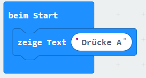

## Lauftext

Beginnen wir mit dem Scrollen einiger Textanweisungen auf dem micro:bit.

+ Rufe <a href="https://rpf.io/microbit-new" target="_blank">rpf.io/microbit-new</a> auf, um ein neues Projekt im MakeCode (PXT) -Editor zu starten. Nenne dein neues Projekt "Wahrsager".

Du kannst den `dauerhaft` Block entfernen, indem du ihn über die Palette ziehst. Wir brauchen ihn nicht für dieses Projekt.

+ Unter "Grundlagen" findest du einen `zeige Text` Block. Ziehe ihn in deinen `beim Start` Block.

+ Teste deinen Code. Du kannst es entweder im Emulator oder auf deinem micro:bit testen.