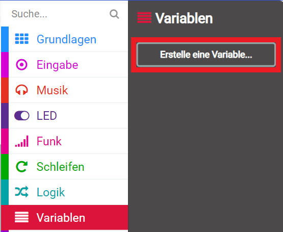
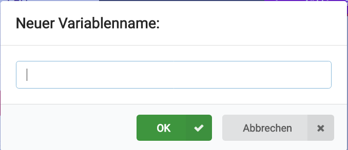
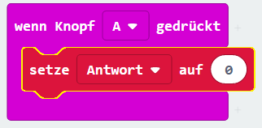
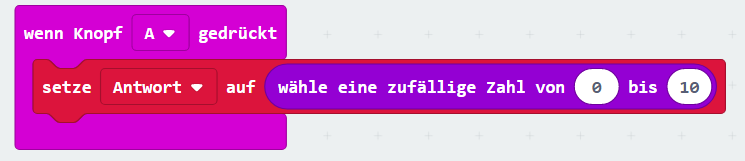
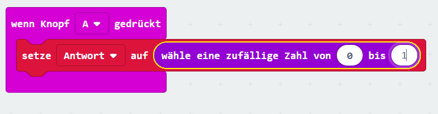
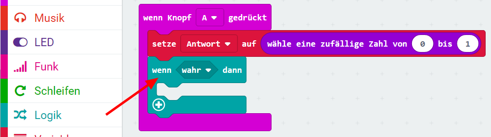
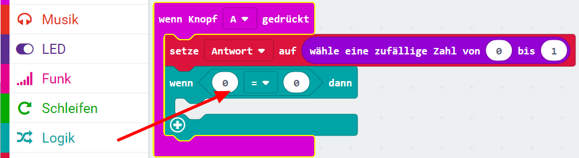
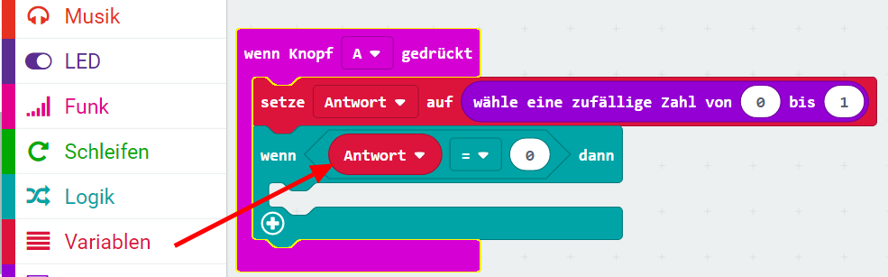
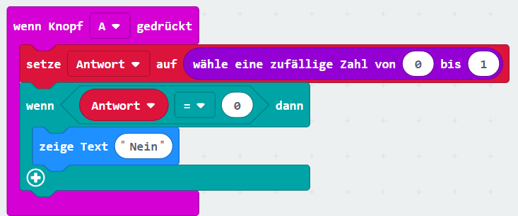

## Eine Entscheidung treffen

Lass uns deinen micro:bit dazu bringen, eine Entscheidung zu treffen, indem wir zufällig eine Zahl auswählen (`0` für "Nein" und `1` für "Ja").

+ Füge einen neuen `wenn Knopf A gedrückt` Block zu deinem Programm hinzu.

+ Lass uns eine neue Variable erstellen, um die Antwort zu speichern. Klicke auf 'Variablen' und dann auf 'Erstelle eine Variable'.

+ Nenne die neue Variable `Antwort`.

+ Ziehe einen `setze Antwort auf` Block aus "Variablen" in deinen `wenn Knopf A gedrückt` Block. Diese Kombination bewirkt, dass die Variable auf den jeweiligen Wert (Voreinstellung "0") gesetzt wird, wenn der Knopf A gedrückt wird.

Wie du sehen kannst, bedeutet der `auf` Block, dass du die Antwort auf die Anzeige setzen kannst.

+ Klicke auf "Mathematik" und ziehe den `wähle eine zufällige Zahl von... bis` Block nach dem `auf`:

+ Stelle diesen Zufalls-Block so ein, dass er eine Zahl zwischen 0 und 1 wählt. Dein Code sollte so aussehen:

+ Als nächstes wollen wir, dass das micro:bit das Wort `Nein` zeigt, aber nur wenn die Variable `Antwort` auf "0" gesetzt ist.

Dafür ziehe einen `wenn ... dann` Block ("Logik") in den `wenn Knopf A gedrückt` Block, und zwar unter den bestehenden Block, der unsere Antwort setzt:

+ Als nächstes ziehe einen `0 = 0` (Vergleich) Block als Bedingung in den `wenn ... dann` Block:

+ Unter "Variablen" findest du einen Block namens "Antwort". Ziehe diesen `Antwort` Block auf die linke Seite des Vergleich-Blocks, wo jetzt eine "0" steht.

+ Code innerhalb des `wenn ... dann` Blocks wird nur ausgeführt, wenn die `Antwort` "0" ist. Lasst uns bei "0" die Antwort `Nein` zeigen. Dafür ziehen wir einen neuen `zeige Text` Block rein uns setzen den anzuzeigenden Text auf "Nein".

+ Teste deinen Code. 
    + Manchmal wird die `Antwort` auf "0" gesetzt und das micro:bit sollte dann "Nein" zeigen.
    + Manchmal wird die `Antwort` aber auch auf "1" gesetzt, und es passiert nichts!