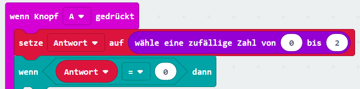

--- challenge ---

## Herausforderung: Mehrere Antworten

Kannst du einen Code hinzufügen, sodass "Ja" auf deinem micro:bit angezeigt wird, sobald die Antwort-Variable auf **1** gesetzt wird? Du kannst den Text auch beliebig verändern, anstatt nur "Ja" und "Nein" auszugeben!

Du kannst deinem micro:bit sogar beibringen "Vielleicht" oder "Frag noch mal" zu sagen, wenn die Antwort-Variable auf 2 steht. Hierfür musst du aber deinen Code ändern, sodass die Antwort-Variable auf eine Zufallszahl zwischen 0 und 2 gesetzt wird.

Tipp: Du kannst auf einen `wenn ... dann` Block rechts-klicken um ihn mitsamt Inhalt zu kopieren.

--- /challenge ---