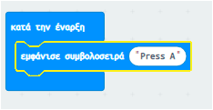

## Κυλιόμενο κείμενο

Ας αρχίσουμε εμφανίζοντας κάποιες κυλιόμενες οδηγίες στο micro:bit σου.

+ Πήγαινε στο <a href="https://rpf.io/microbit-new" target="_blank">rpf.io/microbit-new</a> για να ξεκινήσεις ένα νέο project στον επεξεργαστή MakeCode (PXT). Ονόμασε το νέο σου έργο 'Μάντης'.

Μπορείς να διαγράψεις το μπλοκ `για πάντα` σύροντας το πάνω στην παλέτα εργαλείων, μια και δεν το χρειάζεσαι πλέον γι' αυτό το έργο.

+ Σύρε ένα μπλοκ `εμφάνισε συμβολοσειρά` μέσα στο μπλοκ `κατά την έναρξη`.

+ Δοκίμασε τον κώδικά σου. Μπορείς να το δοκιμάσεις στον προσομοιωτή ή ακόμη και στο ίδιο το micro:bit.