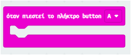
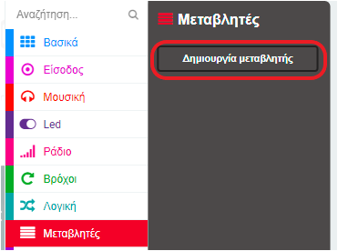
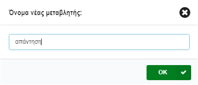
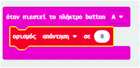
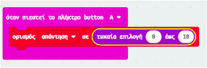
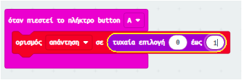
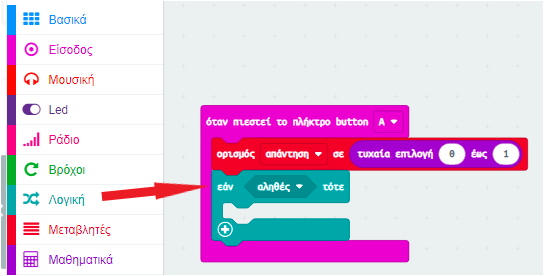
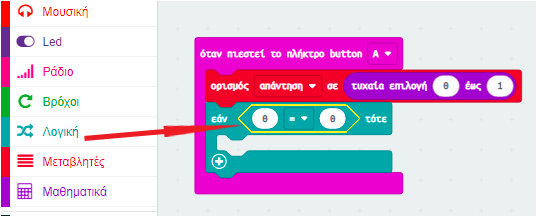
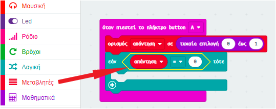
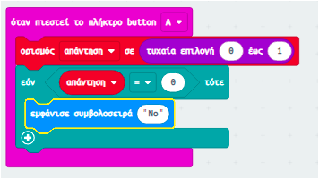

## Λήψη απόφασης

Κάνε το micro:bit σου να παίρνει αποφάσεις επιλέγοντας τυχαία έναν αριθμό (`0` για το 'No' και `1` για το 'Yes').

+ Πρόσθεσε ένα νέο μπλοκ συμβάντος `όταν πιεστεί το πλήκτρο button A` στον κώδικα σου.

+ Ας δημιουργήσουμε τώρα μια νέα μεταβλητή για να αποθηκευτεί η απάντηση. Κάνε κλικ στο μενού 'Μεταβλητές' και μετά κλικ στην επιλογή 'Δημιουργία Μεταβλητής'.

+ Ονόμασε τη νέα μεταβλητή `απάντηση`.

+ Σύρε ένα μπλοκ `ορισμός σε` από το μενού Μεταβλητές εντός του μπλοκ `όταν πιεστεί το πλήκτρο button A` κι επίλεξε τη μεταβλητή `απάντηση`.

Όπως βλέπεις, το μπλοκ `σε` σημαίνει ότι μπορείς να κάνεις ορατή την απάντηση.

+ Κάνε κλικ στο μενού 'Μαθηματικά' και σύρε το μπλοκ `τυχαία επιλογή` μετά το μπλοκ `σε`:

+ Κάνε το μπλοκ τυχαία επιλογή να επιλέγει έναν αριθμό ανάμεσα στο 0 και στο 1. Ο κώδικας σου πρέπει να είναι κάπως έτσι:

+ Στη συνέχεια, θέλεις να δείξεις τη λέξη `No` στο micro:bit, μόνο `εάν` η `απάντηση` είναι 0.

Για να γίνει αυτό, κάνε κλικ και σύρε ένα μπλοκ `εάν` στο κάτω μέρος του μπλοκ συμβάντος `όταν πιεστεί το πλήκτρο button A`:

+ Στη συνέχεια κάνε κλικ και σύρε ένα μπλοκ `=` ως συνθήκη στο `εάν`:

+ Κάνε κλικ και σύρε τη μεταβλητή `απάντηση` στο αριστερό μέρος του μπλοκ `εάν`.

+ Ο κώδικας εντός του μπλοκ `εάν` θα τρέξει μόνο όταν η μεταβλητή `απάντηση` είναι 0. Αφού το 0 είναι το `No`, πρόσθεσε κι ένα μπλοκ `εμφάνισε συμβολοσειρά`.

+ Δοκίμασε τον κώδικά σου. 
    + Κάποιες φορές η μεταβλητή `απάντηση` θα είναι 0, και το micro:bit θα πρέπει να λέει 'No'.
    + Κάποιες φορές η μεταβλητή `απάντηση` θα είναι 1 και τότε δεν θα συμβεί κάτι!