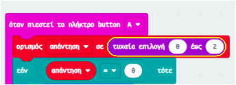

\--- challenge \---

## Πρόκληση: Πολλαπλές απαντήσεις

Μπορείς να γράψεις επιπλέον κώδικα, έτσι ώστε το micro:bit να λεει 'Yes' **εάν** η μεταβλητή απάντηση είναι 1; Μπορείς επίσης να αλλάξεις το κείμενο που θα εμφανίζεται με κάτι πιο ενδιαφέρον από το 'Yes' και 'No'!

Μπορείς ακόμη να κάνεις το micro:bit σου να λέει κάτι σαν 'Maybe' ή 'Ask again' όταν η μεταβλητή απάντηση πάρει την τιμή 2. Για να δουλέψει κάτι τέτοιο, θα χρειαστεί να τροποποιήσεις των κώδικά σου, έτσι ώστε να επιλέγει ένα τυχαίο αριθμό μεταξύ 0 και 2!

Συμβουλή: Μπορείς να κάνεις δεξί κλικ σε ένα μπλοκ `
εάν`, για να φτιάξεις ένα αντίγραφο του κώδικα και των περιεχομένων του.

\--- /challenge \---