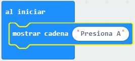

## Texto desplazable

Comencemos por desplazar algunas instrucciones de texto en tu micro:bit.

+ Ve a <a href="https://rpf.io/microbit-new" target="_blank">rpf.io/microbit-new</a> para comenzar un nuevo proyecto en el editor MakeCode (PXT). Nombra a tu nuevo proyecto como 'El Adivino'.

Puedes eliminar el bloque `para siempre` arrastrándolo sobre la paleta, no lo necesitas para este proyecto.

+ Arrastra un bloque `mostrar cadena` dentro de tu bloque `al iniciar`.

+ Prueba tu código. Puedes probarlo en el emulador o en el propio micro:bit.