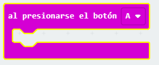
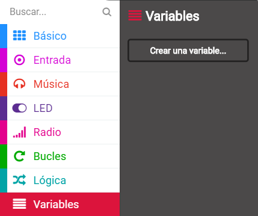
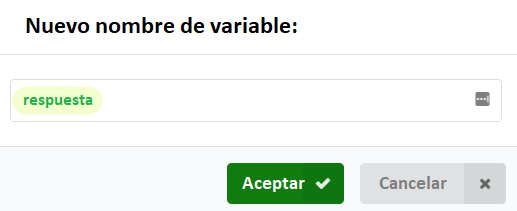
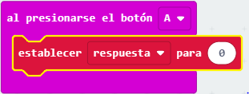
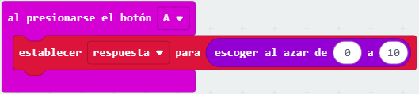
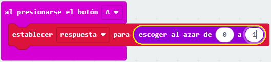
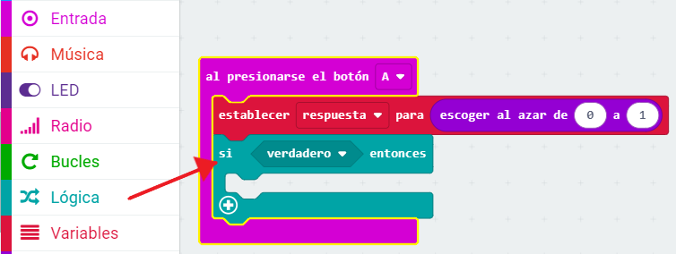
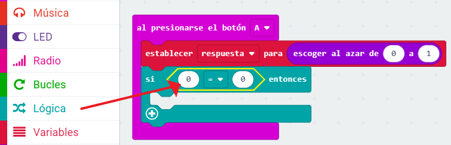
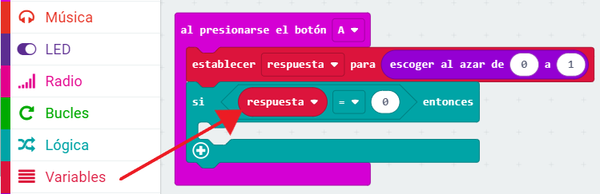
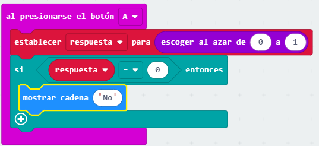

## Tomando una decisión

Hagamos que tu micro:bit tome una decisión al azar eligiendo un número (`0` para 'No' y `1` para 'Sí').

+ Agrega un nuevo evento `al presionar el botón A` a tu código.

+ Vamos a crear una nueva variable para almacenar la respuesta. Haz clic en 'Variables' y luego en 'Crear una variable'.

+ Nombra la nueva variable como `respuesta`.

+ Arrastra un bloque `set` de las Variables a tu bloque `al presionarse el botón A` y selecciona la variable `answer`.

Como puedes ver, el `to` en el bloque significa que puedes establecer la respuesta al monitor.

+ Haz clic en 'Matemática' y arrastra un bloque `pick random` después de `to`:

+ Dile al bloque aleatorio que elija un número entre 0 y 1. Así es como debe verse tu código:

+ A continuación, quieres mostrar la palabra `No` en el micro:bit solo `si` la `respuesta` es 0.

Para hacer esto, arrastra un bloque `si` a la parte baja de tu evento `al presionar el botón A`:

+ Luego arrastra un bloque `=` como condición en el `if`:

+ Arrastra tu variable `answer` al lado izquierdo del bloque `if`.

+ Cualquier código dentro del bloque `if` se ejecutará si la `answer` es 0. Como 0 es `No`, vamos a añadir un bloque `show string`.

+ Prueba tu código. 
    + A veces la `answer` será 0, y el micro:bit debe decir 'No'.
    + A veces la `respuesta` será 1, y ¡no pasará nada!