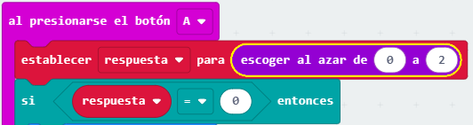

--- challenge ---

## Desafío: Respuestas múltiples

¿Puedes añadir código para que 'Sí' se muestre en tu micro:bit **si** la respuesta es 1? ¡Incluso puedes cambiar el texto mostrado a algo más interesante que solo "Sí" y "No"!

Incluso puedes hacer que tu micro:bit diga algo como 'Tal vez' o 'Preguntar de nuevo' si la respuesta es 2. Para que esto funcione, también tendrás que cambiar tu código para elegir un número al azar entre 0 y 2!

Consejo: Puedes hacer clic derecho en un bloque `si` para duplicar el bloque y su contenido.

--- /challenge ---