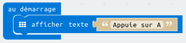

## Faire défiler du texte

Commençons par faire défiler quelques instructions de texte sur ton micro:bit.

+ Va sur <a href="https://rpf.io/microbit-new" target="_blank">rpf.io/microbit-new</a> pour démarrer un nouveau projet dans l'éditeur MakeCode (PXT). Appelle ton nouveau projet « Diseuse de bonne aventure ».

Tu peux supprimer le bloc `toujours` en le déplaçant sur la palette, tu n'en auras pas besoin pour ce projet.

+ Place un bloc `afficher texte` à l'intérieur du bloc `au démarrage`.

+ Teste ton code. Tu peux le tester sur l'émulateur ou bien sur le micro:bit lui-même.