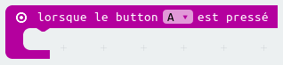

## Prendre un décision

Laissons la micro:bit prendre une décision en choisissant un nombre au hasard (`0` pour 'Non' et `1` pour 'Oui')

+ Ajoute un nouvel événement `lorsque le bouton A est pressé` dans ton code.

+ Créons une variable pour stocker la réponse.
  Clique sur 'Variables', puis sur 'Créer une variable'.

+ Nomme la nouvelle variable `réponse`.

+ Place un bloc `définir à` depuis Variables dans ton bloc `lorsque le bouton A est pressé`,
  et sélectionne la variable `réponse`.

Comme tu peux le voir, le `à` dans le bloc signifie que tu dois régler la réponse à afficher.

+ Clique sur 'Math' et place un bloc `choisir au hasard entre 0 et ...` après le `à`.

+ Configure le bloc `choisir au hasard` pour qu'il prenne un nombre entre 0 et 1.
  Voici à quoi devrait ressembler ton code&nbsp;:

+ Ensuite, tu veux afficher le mot `Non` sur la micro:bit seulement `si` la `réponse` vaut 0.

Pour cela, place un bloc `si` tout en bas de l'événement `lorsque le bouton A est pressé`&nbsp;

+ Place un bloc `=` en tant que condition dans le bloc `si`&nbsp;:

+ Place ta variable `réponse` dans la partie gauche de la condition du bloc `si`.

+ Le code placé à l'intérieur du bloc `si` ne s'exécutera que si la `réponse` vaut 0.
   Etant donné que le 0 correspond à `Non`, ajoutons un autre bloc `afficher texte`.

+ Teste ton code&nbsp;
	+ Parfois la `réponse` vaudra 0, et la micro:bit devra dire 'Non'.
	+ Parfois la `réponse` vaudra 1, et rien ne se passera&nbsp;!
