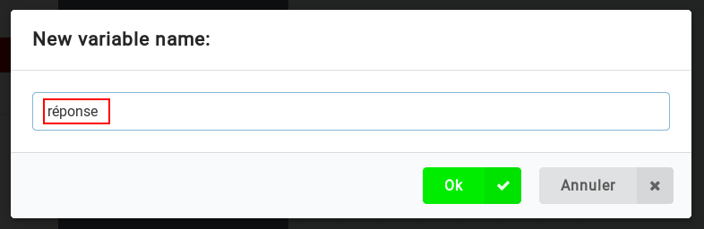
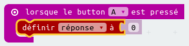
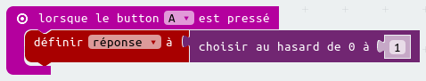
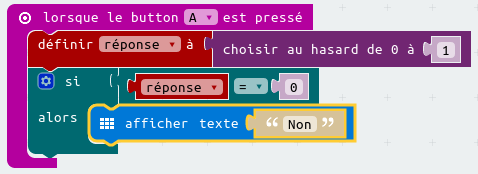

## Prendre un décision

Laissons le micro:bit prendre une décision en choisissant un nombre au hasard (`0` pour "Non" et `1` pour "Oui").

+ Ajoute un nouvel événement `lorsque le bouton A est pressé` dans ton code.

+ Crée une variable pour stocker la réponse. Clique sur « Variables », puis sur « Créer une variable ».

+ Nomme la nouvelle variable `réponse`.

+ Place un bloc `définir à` depuis Variables dans ton bloc `lorsque le bouton A est pressé`, et sélectionne la variable `réponse`.

Comme tu peux le voir, le `à` dans le bloc signifie que tu dois régler la réponse à afficher.

+ Clique sur « Math » et fais glisser un bloc `choisir au hasard` après le `à` :

+ Configure le bloc `choisir au hasard` pour qu'il choisisse un nombre entre 0 et 1. Voici à quoi devrait ressembler ton code :

+ Ensuite, tu veux afficher le mot `Non` sur le micro:bit seulement `si` la `réponse` vaut 0.

Pour cela, place un bloc `si` tout en bas de l'événement `lorsque le bouton A est pressé` :

+ Ensuite, fais glisser un bloc `=` comme condition dans le bloc `si` :

+ Place ta variable `réponse` dans la partie gauche de la condition du bloc `si`.

+ Tout code placé à l'intérieur du bloc `si` ne s'exécutera que si la `réponse` vaut 0. Etant donné que le 0 correspond à `Non`, ajoutons un autre bloc `afficher texte`.

+ Teste ton code. 
    + Parfois la `réponse` vaudra 0, et le micro:bit devra dire « Non ».
    + Parfois, la `réponse` sera 1, et rien ne se passera !