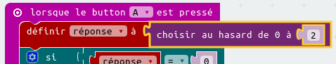

--- challenge ---
## Défi : Plusieurs réponse
Sauras-tu afficher 'Oui' sur ton micro:bit __si__ la `réponse` est 1 ?
Tu peux même changer le texte affiché par quelque chose de plus intéressant que juste 'Oui' ou 'Non'&nbsp;!

Tu peux même faire en sorte que ton micro:bit dise quelque chose comme 'Peut être' ou 'Demande encore' si la réponse est 2.
Pour que cela fonctionne, tu devras aussi changer ton code pour choisir une valeur entre 0 et 2 !

Astuce&nbsp;: tu peux faire un clic-droit sur un bloc `si` pour dupliquer ce bloc et son contenu.

--- /challenge ---
