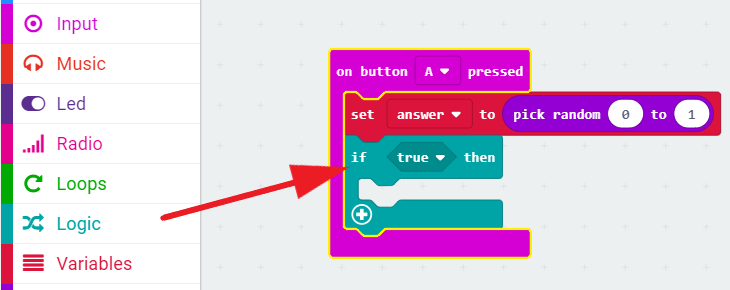

## निर्णय लेना

आइए हम यादृच्छिक रूप से 'नहीं' के लिए `0` और 'हाँ' के लिए `1` संख्या को चुनकर आपके micro:bit से कोई निर्णय करवाएँ।

+ अपने कोड में `on button A pressed` (<0>बटन A दबाए जाने पर</0>) नामक एक नया इवेंट जोड़ें।

+ आइए हम उत्तर को संगृहीत करने के लिए एक नया वेरिएबल बनाएँ। 'Variables' ('वेरिएबल') पर क्लिक करें और फिर 'Make a variable' ('एक वेरिएबल बनाएँ') पर क्लिक करें।

+ `उत्तर` नामक नए वेरिएबल को कोई नाम दें।

+ वेरिएबल्स में से एक `set` (सेट) ब्लॉक को अपने `on button A+B pressed` (बटन A+B दबाए जाने पर) ब्लॉक में ड्रैग करें और `उत्तर` वेरिएबल का चयन करें।

जैसा कि आप देख सकते हैं, ब्लॉक में `to` होने का मतलब है कि आप उत्तर को प्रदर्शित करने के लिए सेट कर सकते हैं।

+ 'Math' (मैथ) पर क्लिक करें और `pick random` (यादृच्छिक रूप से चुनें) ब्लॉक को ड्रैग करके `to` (तक) के आगे ले जाएँ:

+ रैंडम ब्लॉक को 0 और 1 के बीच की कोई संख्या चुनने के लिए कहें। यहाँ दिखाया गया है कि आपका कोड कैसा दिखना चाहिए:

+ इसके बाद, आप micro:bit पर `नहीं` शब्द केवल तभी प्रदर्शित करना चाहेंगे यदि `if` (यदि) का `उत्तर` 0 है।

ऐसा करने के लिए, `if` (यदि) ब्लॉक को अपने `on button A pressed` (बटन A दबाए जाने पर) इवेंट के नीचे ड्रैग करें:

+ उसके बाद `if` (यदि) में शर्त के रूप में `=` ब्लॉक को खींचें>:

+ अपने `उत्तर` वेरिएबल को खींचकर `if` (यदि) ब्लॉक के बाईं तरफ लाएँ।

+ `if` (यदि) ब्लॉक के अंदर कोई भी कोड केवल तभी चलेगा यदि `उत्तर` 0 होगा। चूंकि 0 का मतलब `नहीं` है, आइए हम एक `show string` (स्ट्रिंग दिखाएँ) ब्लॉक जोड़ें।

+ अपने कोड का परीक्षण करें। 
    + कभी-कभी `उत्तर` 0 होगा, और micro:bit 'नहीं' कहेगा।
    + कभी-कभी `उत्तर` 1 होगा, और कुछ भी नहीं होगा!