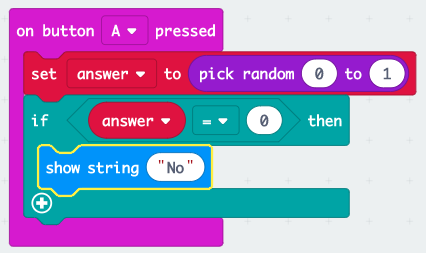

## Donošenje odluke

Donosimo vaš mikro: bit za donošenje odluke nasumičnim odabirom broja (`0` za 'Ne' i `1` za 'Da').

+ Dodajte novi `na gumbu Pritisnuti` događaj u svoj kôd.

+ Kreirajmo novu varijablu za pohranjivanje odgovora. Kliknite "Varijable", a zatim kliknite "Uradi varijablu".

+ Imenujte novu varijablu koja se zove `odgovor`.

+ Povucite blok `skupa` iz varijable u svoj gumb `on Pritisnite pritisnuti` blok i odaberite varijablu `odgovora`.

Kao što vidite, `do` u bloku znači da možete postaviti odgovor na prikaz.

+ Kliknite „Math” i povucite `pokupiti slučajan` blok nakon `kako bi`:

+ Recite slučajnom bloku da odaberete broj između 0 i 1. Ovako bi tvoj kôd trebao izgledati:

+ Zatim želite prikazati riječ `No` na mikro: malo samo `ako` `odgovor` 0.

Da biste to učinili, povucite `ako` blok na dnu `na tipku A pritisne` događaj:

+ Zatim povucite blok `=` kao uvjet u `ako je`:

+ Povucite varijablu `odgovor` na lijevu stranu bloka `ako`.

+ Bilo koji kôd unutar `ako je` blok pokrenut će se samo ako je `odgovora` 0. Kako je `Ne`, dodamo blok `prikazivanja`.

+ Testiraj svoj kôd. 
    + Ponekad će `odgovor` biti 0, a mikro: bit treba reći „Ne“.
    + Ponekad `odgovor` će biti 1, a ništa se neće dogoditi!