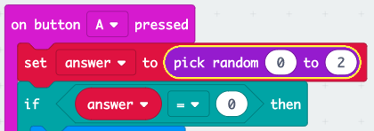

\--- challenge \---

## Izazov: Višestruki odgovori

Možete li dodati kôd tako da se na mikro: bit **prikaže "Da", ako je** odgovor 1? Možete čak i promijeniti prikazani tekst u nešto zanimljivije od samo 'Da' i 'Ne'!

Možete čak napraviti svoj mikro: bit ćete reći nešto poput "Možda" ili "Pitaj ponovo" ako je odgovor 2. Da biste ovo učinili, morat ćete i promijeniti kôd da biste odabrali slučajni broj između 0 i 2!

Savjet: Desnim klikom na blok `if` možete duplicirati i duplicirati blok i njegov sadržaj.

\--- /challenge \---