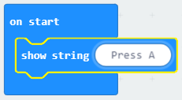

## ಸ್ಕ್ರೋಲಿಂಗ್ ಪಠ್ಯ

ನಿಮ್ಮ micro:bit ನಲ್ಲಿ ಕೆಲವು instructionsಗಳನ್ನು ಸ್ಕ್ರೋಲ್ ಮಾಡುವ ಮೂಲಕ ಪ್ರಾರಂಭಿಸೋಣ.

+ MakeCode (PXT) ಎಡಿಟರ್ ನಲ್ಲಿ ಹೊಸ ಯೋಜನೆಯನ್ನು ಪ್ರಾರಂಭಿಸಲು <a href="https://rpf.io/microbit-new" target="_blank">rpf.io/microbit-new</a>ಗೆ ಹೋಗಿ. ನಿಮ್ಮ ಹೊಸ ಯೋಜನೆಯನ್ನು 'Fortune Teller' ಎಂದು ಕರೆಯಿರಿ. 

` forever ` block ಅನ್ನು ಪ್ಯಾಲೆಟ್ ಮೇಲೆ ಎಳೆದು ಅದನ್ನು ತೆಗೆಯಿರಿ. ನಿಮಗೆ ಅದರ ಅವಶ್ಯಕತೆ ಇಲ್ಲ.

+ `start` block ಒಳಗೆ ಒಂದು `show string` block ಅನ್ನು ಎಳೆಯಿರಿ.

+ ನಿಮ್ಮ code ಅನ್ನು ಪರೀಕ್ಷಿಸಿ. ನೀವು ಅದನ್ನು ಎಮ್ಯುಲೇಟರ್‌ನಲ್ಲಿ ಅಥವಾ micro:bit ನಲ್ಲಿ ಪರೀಕ್ಷಿಸಬಹುದು.