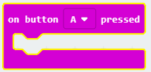
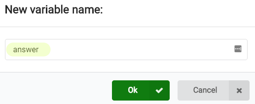

## ನಿರ್ಧಾರ ಮಾಡುವುದು

ಯಾವುದಾದರೊಂದು ಸಂಖ್ಯೆಯನ್ನು ಆಯ್ಕೆ ಮಾಡಿ,ನಿಮ್ಮ micro:bit ನಿರ್ಧಾರ ತೆಗೆದುಕೊಳ್ಳಲು ಸಹಾಯ ಮಾಡೋಣ (` 0 ` 'ಇಲ್ಲ' ಗಾಗಿ ಮತ್ತು ` 1` 'ಹೌದು' ಗಾಗಿ).

+ ` on button A pressed ` ಎಂಬ ಹೊಸ ಈವೆಂಟ್ಟನ್ನು ನಿಮ್ಮ code ಗೆ ಸೇರಿಸಿ.

+ ಉತ್ತರವನ್ನು ಸಂಗ್ರಹಿಸಲು ಹೊಸ ವೇರಿಯಬಲ್ ಅನ್ನು ರಚಿಸೋಣ. 'Variables' ಕ್ಲಿಕ್ ಮಾಡಿ ,ನಂತರ 'Make a Variable' ಕ್ಲಿಕ್ ಮಾಡಿ.

+ ಹೊಸ ವೇರಿಯೇಬಲ್ ಅನ್ನು `answer` ಎಂದು ಹೆಸರಿಸಿ.

+ ವೇರಿಯೇಬಲ್ಸ್ ಇಂದ `set` block ಅನ್ನು `on button A pressed` block ಗೆ drag ಮಾಡಿ ಮತ್ತು `answer` ವೇರಿಯೇಬಲ್ ಅನ್ನು ಆಯ್ಕೆ ಮಾಡಿ.

ನೀವು ನೋಡುವಂತೆ, `to` block ನಲ್ಲಿದ್ದರೆ ,ನೀವು ಉತ್ತರವನ್ನು display ಗೆ ಹೊಂದಿಸಬಹುದು ಎಂದರ್ಥ.

+ 'Math' ಕ್ಲಿಕ್ ಮಾಡಿ ಮತ್ತು `pick a random` block ಅನ್ನು `to` ಆದಮೇಲೆ ಎಳಿಯಿರಿ:

+ 0 ಮತ್ತು 1 ರ ನಡುವಿನ ಸಂಖ್ಯೆಯನ್ನು ಆಯ್ಕೆ ಮಾಡಲು random block ಗೆ ಹೇಳಿ. ನಿಮ್ಮ code ಹೇಗೆ ಕಾಣಬೇಕು:

+ ಮುಂದೆ, `if` `answer` 0 ಆಗಿದ್ದರೆ ಮಾತ್ರ , ` No` ಎಂಬ ಪದವನ್ನುmicro:bit ಮೇಲೆ display ಮಾಡುವಿರಿ 

ಇದನ್ನು ಮಾಡಲು, `if` block ಅನ್ನು ನಿಮ್ಮ `on button A pressed` ಇವೆಂಟ್ ನ ಕೆಳಗಡೆ drag ಮಾಡಿ:

+ ಮುಂದೆ, ಒಂದು `=` block ಅನ್ನು ನಿಮ್ಮ `if` block ನ ಕಂಡೀಶನ್ ಅಂತೆ drag ಮಾಡಿ. 

+ ನಿಮ್ಮ `answer` ವೇರಿಯೇಬಲ್ ಅನ್ನು `if` block ನ ಎಡಬದಿಗೆ ಎಳಿಯಿರಿ.

+ `answer` 0 ಇದ್ದರೆ ಮಾತ್ರ,` if ` block ಒಳಗಿರುವ ಯಾವುದೇ code run ಆಗುವುದು. 0 `No` ಆಗಿರುವುದರಿಂದ `show string` block ಅನ್ನು ಸೇರಿಸೋಣ.

+ ನಿಮ್ಮ code ಅನ್ನು ಪರೀಕ್ಷಿಸಿ. 
    + ಕೆಲವೊಮ್ಮೆ ` answer ` 0 ಆಗಿರುತ್ತದೆ ಮತ್ತು micro:bit 'No' ಎಂದು ಹೇಳಬೇಕು.
    + ಕೆಲವೊಮ್ಮೆ ` answer` 1 ಆಗಿರುತ್ತದೆ, ಮತ್ತು ಏನೂ ಆಗುವುದಿಲ್ಲ!