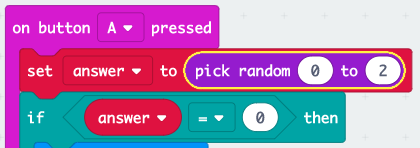

\--- challenge \---

## ಸವಾಲು: ಬಹು ಉತ್ತರಗಳು

ಉತ್ತರ 1 **if ** ಆಗಿದ್ದರೆ ,ನಿಮ್ಮ micro:bit ನಲ್ಲಿ 'Yes' ಅನ್ನು ಪ್ರದರ್ಶಿಸುವಂತೆ code ಸೇರಿಸಬಹದೇ? ? ತೋರಿಸಿದ ಪಠ್ಯವನ್ನು ಕೇವಲ 'Yes' ಮತ್ತು 'No' ಎನ್ನುವುದಕ್ಕಿಂತ ಹೆಚ್ಚು ಆಸಕ್ತಿದಾಯಕ ವಿಷಯಕ್ಕೆ ಬದಲಾಯಿಸಬಹುದು!

ಉತ್ತರ 2 ಆಗಿದ್ದರ ,ನಿಮ್ಮ micro:bit ಅನ್ನು'Maybe' ಅಥವಾ 'Ask again' ಎಂದು ಹೇಳುವಂತೆ ಮಾಡಬಹುದು. ಇದು ಕೆಲಸ ಮಾಡುವಂತೆ ಮಾಡಲು, 0 ಮತ್ತು 2 ರ ನಡುವೆ ಯಾವುದಾದರು ಸಂಖ್ಯೆಯನ್ನು ಆಯ್ಕೆ ಮಾಡಲು ನಿಮ್ಮ code ಅನ್ನು ಸಹ ನೀವು ಬದಲಾಯಿಸಬೇಕಾಗುತ್ತದೆ!

ಸುಳಿವು: ನೀವು `if` block ಅನ್ನು ಬಲ-ಕ್ಲಿಕ್ ಮಾಡಿ ಅದರ ವಿಷಯಗಳನ್ನು ನಕಲು ಮಾಡಬಹುದು.

\--- /challenge \---