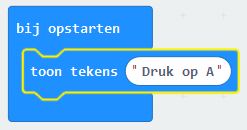

## Scrollende tekst

Laten we beginnen door enkele tekstinstructies op je micro:bit te laten scrollen.

+ Ga naar <a href="https://rpf.io/microbit-new" target="_blank">rpf.io/microbit-new</a> om een ​​nieuw project te starten in de MakeCode (PXT) editor. Noem je nieuwe project 'Waarzegger'.

Je kunt het `de hele tijd` blok verwijderen door het over het palet te slepen, je hebt het niet nodig voor dit project.

+ Sleep een `toon tekens` blok in je `bij opstarten` blok.

+ Test je code. Je kunt het testen in de emulator of op de micro: bit zelf.