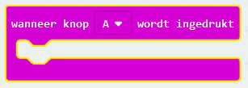
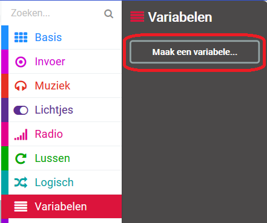
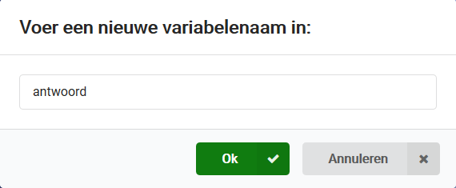
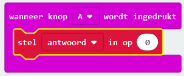
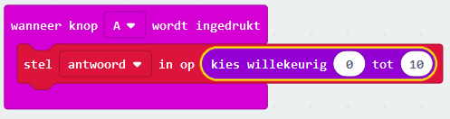
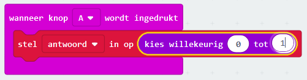
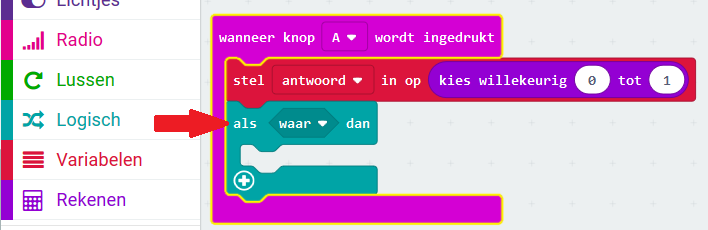
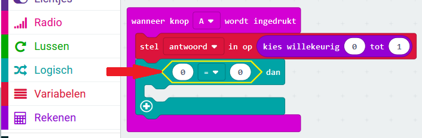
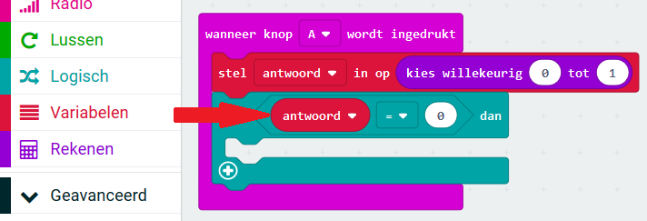
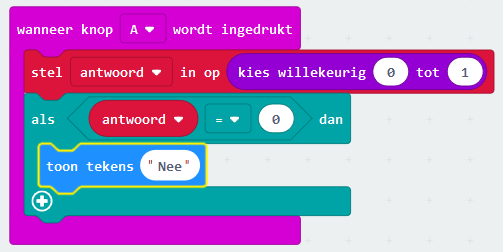

## Een beslissing nemen

Laten we je micro:bit nemen om een beslissing te nemen door willekeurig een getal te kiezen (`0` voor 'Nee' en `1` voor 'Ja').

+ Voeg een nieuw `wanneer knop A wordt ingedrukt` blok toe aan je code.

+ Laten we een nieuwe variabele maken om het antwoord op te slaan. Klik op 'Variables' en vervolgens op 'Make a variable'.

+ Geef de nieuwe variabele de naam `antwoord`.

+ Sleep een `stel in op` blok van Variables in je `wanneer knop A wordt ingedrukt` blok en selecteer de `antwoord` variabele.

Zoals je kunt zien, betekent het `op` in het blok dat je het antwoord kunt instellen.

+ Klik op 'Rekenen' en sleep een `kies willekeurig` blok na de `op`:

+ Vertel het random blok om een getal tussen 0 en 1 te kiezen. Zo zou de code eruit moeten zien:

+ Vervolgens wil je het woord `Nee` op de micro:bit tonen alleen `als` het `antwoord` 0 is.

Sleep hiervoor een `als` blok naar de onderkant van je `wanneer knop A wordt ingedrukt` gebeurtenis:

+ Sleep vervolgens een `=` blok als de voorwaarde in de `als`:

+ Sleep je `antwoord` variabele naar de linkerkant van het `als` blok.

+ Alle code binnen het `als` blok wordt alleen uitgevoerd als het `antwoord` 0 is. Als 0 `Nee` is, laten we een `toon tekens` blok toevoegen.

+ Test je code. 
    + Soms zal het `antwoord` 0 zijn, en de micro:bit moet dan 'Nee' zeggen.
    + Soms zal het `antwoord` 1 zijn, en er zal niets gebeuren!