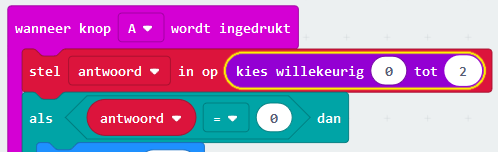

--- challenge ---

## Uitdaging: meerdere antwoorden

Kun je code toevoegen zodat 'Ja' wordt getoond op je micro:bit **als** het antwoord 1 is? Je kunt zelfs de getoonde tekst veranderen in iets interessanters dan alleen 'Ja' en 'Nee'!

Je kunt zelfs je micro:bit iets laten zeggen als 'Misschien' of 'Opnieuw vragen' als het antwoord 2 is. Om dit te laten werken, moet je ook je code veranderen om een willekeurig nummer tussen 0 en 2 te kiezen!

Tip: Je kunt met de rechtermuisknop klikken op een `als` blok om het blok en de inhoud ervan te dupliceren.

--- /challenge ---