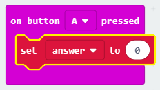
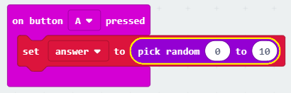

## Making a decision

Let's get your micro:bit to make a decision by randomly choosing a number (`0` for 'No' and `1` for 'Yes').

+ Add a new `on button A pressed` event to your code.

+ Let's create a new variable to store the answer. Click the 'Variables' and then click 'Make a variable'.

+ Name the new variable called `answer`.

+ Drag a `set` block from Variables into your `on button A pressed` block and select the `answer` variable.

As you can see, the `to` in the block means that you can set the answer to display.

+ Click 'Math' and drag a `pick random` block after the `to`:

+ Tell the random block to choose a number between 0 and 1. Here's how your code should look:

+ Next, you want to display the word `No` on the micro:bit only `if` the `answer` is 0.

To do this, drag an `if` block onto the bottom of your `on button A pressed` event:

+ Next drag an `=` block as the condition in the `if`:

+ Drag your `answer` variable onto the left side of the `if` block.

+ Any code inside the `if` block will only run if the `answer` is 0. As 0 is `No`, let's add a `show string` block.

+ Test your code. 
    + Sometimes the `answer` will be 0, and the micro:bit should say 'No'.
    + Sometimes the `answer` will be 1, and nothing will happen!